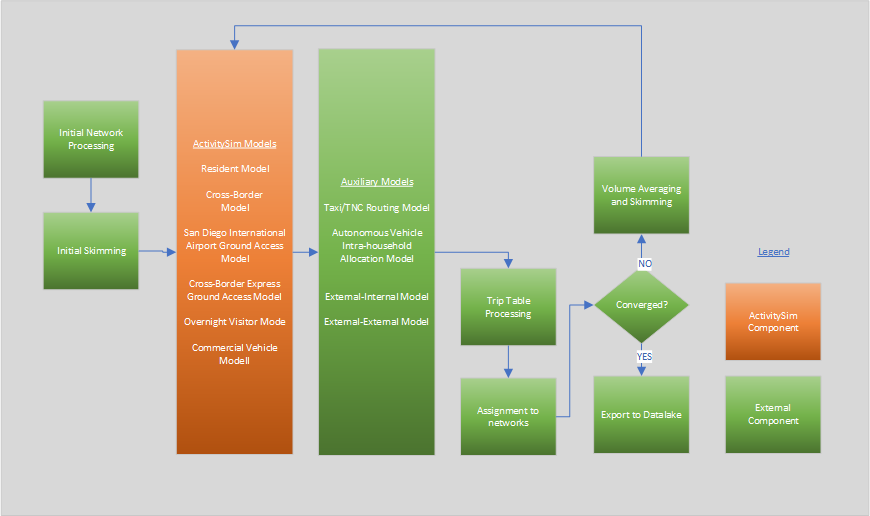

# Model Design

The ABM3 model system is primarily based on the [ActivitySim](https://research.ampo.org/activitysim/) platform; ActivitySim is used to model resident travel, cross-border travel, overnight visitor travel, airport ground access travel, and commercial vehicle travel including light, medium, and heavy commercial vehicles. Aggregate models are used to model external-internal travel (from external stations other than the U.S./Mexico border crossing) and through travel. The model system relies on [EMME](https://www.bentley.com/software/emme/) software for network processing, skimming, and assignment. Models are mostly implemented in [Python](https://www.python.org/), and some models are implemented in [Java] (https://www.java.com/en/).

The overall design of the model is shown in the figure below.

The system starts by performing initial input processing in EMME. This includes building transport networks and scenarios for skimming and assignment. An initial set of skims are created based on input trip tables (e.g. warm start). Then disaggregate choice models in ActivitySIm are run, including the resident model, the crossborder travel model, two airport ground access models, the overnight visitor model, and the commercial vehicle model. Next auxiliary models are run; the taxi/TNC routing model and the autonomous vehicle intra-household allocation model are run in Java. Aggregate external-internal and through travel models are run in Python. After all models are run, trip tables are built from the result and assigned to transport networks. A check is made to determine whether the model has reached convergence (currently this is set to three feedback iterations). If convergence is reached, outputs are processed for export to the SANDAG Datalake for reporting summaries. If not, speeds from assignment are averaged using method of successive averages, and skims are rebuilt for the next iteration. The model system is then re-run with the updated skims.

ActivitySim is used to represent all internal travel and internal-external made by residents of the SANDAG region (modeled area).  The decision-makers in the model system include both persons and households. These decision-makers are created (synthesized) for each simulation year and land-use scenario, based on Census data and forecasted distributions of households and persons by key socio-economic categories. A similar but simplified method is used to generate disaggregate populations for cross-border, airport ground access, and overnight visitor models. The decision-makers are used in the subsequent discrete-choice models in a microsimulation framework where a single alternative is selected from a list of available alternatives according to a probability distribution.  The probability distribution is generated from a logit model which considers the attributes of the decision-maker and the attributes of the various alternatives. The application paradigm is referred to as Monte Carlo simulation, since a random number draw is used to select an alternative from the probability distribution. The decision-making unit is an important element of model estimation and implementation and is explicitly identified for each model specified in the following sections.

A key advantage of using the micro-simulation approach is that there are essentially no computational constraints on the number of explanatory variables that can be included in a model specification.  However, even with this flexibility, the model system will include some segmentation of decision-makers.  Segmentation is a useful tool to both structure models (for example, each person type segment could have their own model for certain choices) and to characterize person roles within a household.  Segments can be created for persons as well as households.
