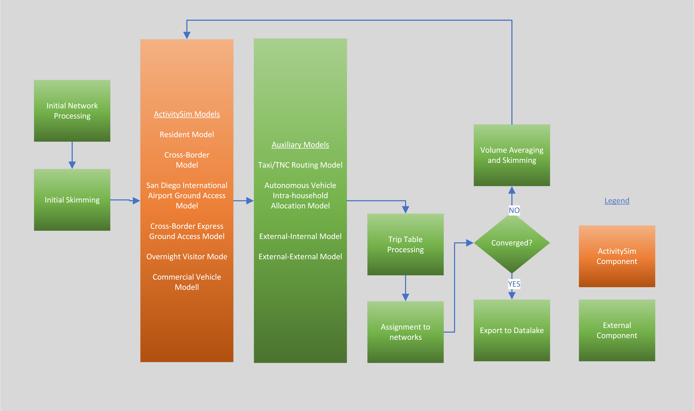
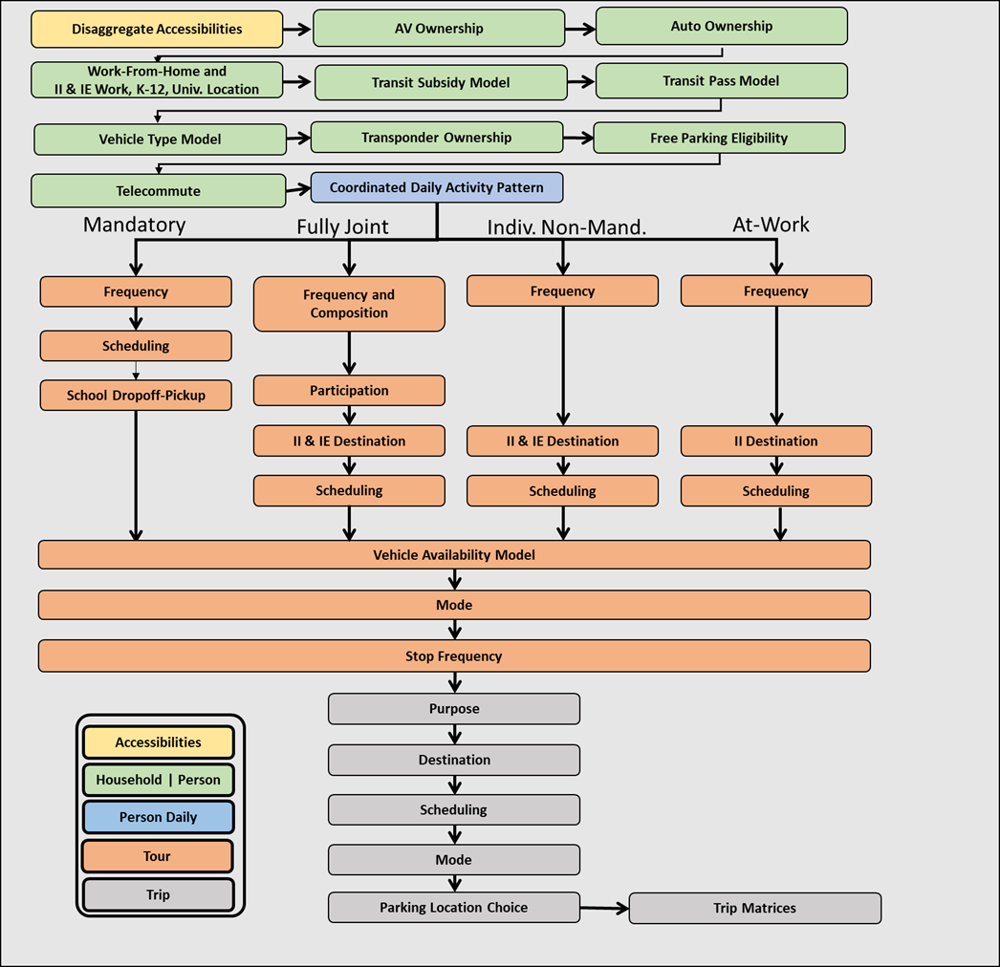
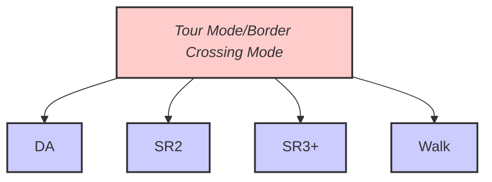
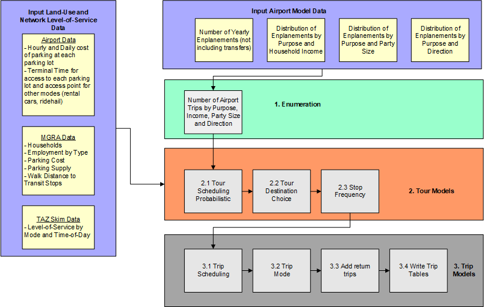
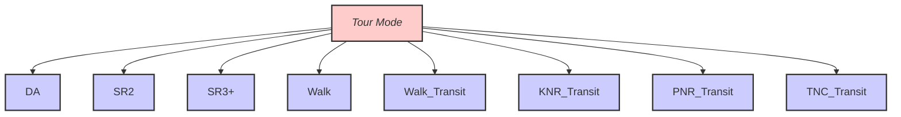
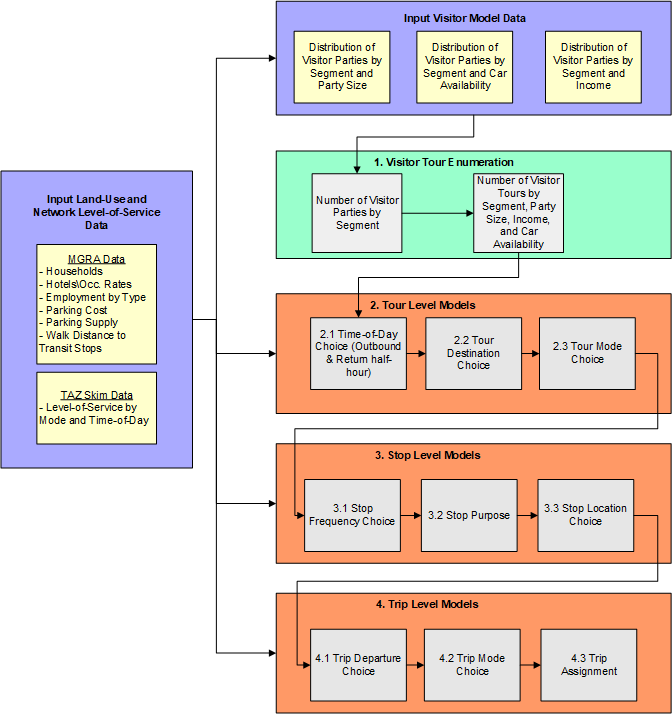
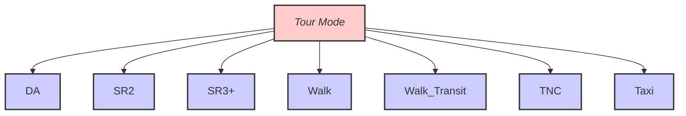

# Model Design

The ABM3 model system is primarily based on the [ActivitySim](https://research.ampo.org/activitysim/) platform; ActivitySim is used to model resident travel, cross-border travel, overnight visitor travel, airport ground access travel, and commercial vehicle travel including light, medium, and heavy commercial vehicles. Aggregate models are used to model external-internal travel (from external stations other than the U.S./Mexico border crossing) and through travel. The model system relies on [EMME](https://www.bentley.com/software/emme/) software for network processing, skimming, and assignment. Models are mostly implemented in [Python](https://www.python.org/), and some models are implemented in [Java] (https://www.java.com/en/).

The overall design of the model is shown in the figure below.

The system starts by performing initial input processing in EMME. This includes building transport networks and scenarios for skimming and assignment. An initial set of skims are created based on input trip tables (e.g. warm start). Then disaggregate choice models in ActivitySIm are run, including the resident model, the crossborder travel model, two airport ground access models, the overnight visitor model, and the commercial vehicle model. Next auxiliary models are run; the taxi/TNC routing model and the autonomous vehicle intra-household allocation model are run in Java. Aggregate external-internal and through travel models are run in Python. After all models are run, trip tables are built from the result and assigned to transport networks. A check is made to determine whether the model has reached convergence (currently this is set to three feedback iterations). If convergence is reached, outputs are processed for export to the SANDAG Datalake for reporting summaries. If not, speeds from assignment are averaged using method of successive averages, and skims are rebuilt for the next iteration. The model system is then re-run with the updated skims.

ActivitySim is used to represent all internal travel and internal-external made by residents of the SANDAG region (modeled area).  The decision-makers in the model system include both persons and households. These decision-makers are created (synthesized) for each simulation year and land-use scenario, based on Census data and forecasted distributions of households and persons by key socio-economic categories. A similar but simplified method is used to generate disaggregate populations for cross-border, airport ground access, and overnight visitor models. The decision-makers are used in the subsequent discrete-choice models in a microsimulation framework where a single alternative is selected from a list of available alternatives according to a probability distribution.  The probability distribution is generated from a logit model which considers the attributes of the decision-maker and the attributes of the various alternatives. The application paradigm is referred to as Monte Carlo simulation, since a random number draw is used to select an alternative from the probability distribution. The decision-making unit is an important element of model estimation and implementation and is explicitly identified for each model specified in the following sections.

A key advantage of using the micro-simulation approach is that there are essentially no computational constraints on the number of explanatory variables that can be included in a model specification.  However, even with this flexibility, the model system will include some segmentation of decision-makers.  Segmentation is a useful tool to both structure models (for example, each person type segment could have their own model for certain choices) and to characterize person roles within a household.  Segments can be created for persons as well as households.

## Resident Model

The resident model structure is based on the Coordinated Travel Regional Activity-based Modeling Platform (CT-RAMP). The figure below shows the resident model structure. In order to understand the flow chart, some definitions are required. These are described in more detail below.

- Tour: A sequence of trips that start and end at an anchor location. In ActivitySim, anchors are home or work.
- Primary destination: The “main” activity of the tour; this activity determines the tour purpose. It also divides the tour into two "legs"; the sequence of trips from the anchor location to the primary destination is the outbound leg, and the sequence of trips from the primary destination back to the anchor location is the inbound or return leg.
- Mandatory activity: Work or school
- Non-mandatory activity: Any out of home activity that is not work or school, including maintenance activities such as shopping as well as discretionary activities such as out-of-home recreation and eating out.
- Fully joint tour: A tour in which two or more household members travel together to all out-of-home activity locations and return home together. In other words, no household member is picked-up or dropped-off en route.
- Intermediate stop: An out-of-home activity location on the tour other than the anchor location or the primary destination. Intermediate stops are made on the way from the anchor location to the primary destination (outbound) or on the way from the primary destination back to the anchor location (inbound).
- Tour mode: The “main mode” or “preferred mode” of the tour. This is an abstract concept used categorize the tour with respect to accessibility and constrain the availability of modes for trips on the tour to ensure some consistency of modes used for each trip.

The resident model design is shown below.

The first model in the sequence is disaggregate accessibilities. This is a recent addition to ActivitySim in which the tour destination choice model is run for a prototypical sample population covering key market segments and destination choice logsums from the model are written out for each tour in the population. These destination choice logsums are then merged with the actual synthetic population and used as accessibility variables in downstream models such as auto ownership, coordinated daily activity patterns, and tour frequency. are mandatory location choice; this model is run for all workers and students regardless of whether they attend work or school on the simulated day.

Next a set of long-term and mobility models are run. The first model in the sequence predicts whether an autonomous vehicle is owned by the household. This model conditions the next model, which predicts the number of autos owned. If an autonomous vehicle is owned, multiple cars are less likely. Next, the mandatory (work and school) location choice models are run. The work location choice models includes a model to predict whether the worker has a usual out-of-home work location or exclusively works from home. If the worker chooses to work from home, they will not generate a work tour. An external worker identification model determines whether each worker with an out-of-home workplace location works within the region or external to the region. If they work external to the region, the external station is identified. Any primary destination of any work tours generated by the worker will be the external station chosen by this model. A work location choice model predicts the internal work location of each internal worker, and a school location choice model predicts the school location of each student.

Next, a set of models predicts whether workers and students have subsidized transit fares and if so, the percent of transit fare that is subsidized, and whether each person in the household owns a transit pass. A vehicle type choice model then runs, which predicts the body type, fuel type, and age of each vehicle owned by the household; this model was extended to predict whether each vehicle is autonomous, conditioned by the autonomous vehicle ownership model.

Next, we predict whether each household has access to a vehicle transponder which can be used for managed lane use. We assume that all vehicles built after a certain year (configurable by the user) are equipped with transponders. Next we predict whether each worker has subsidized parking available at work. Finally we predict the telecommute frequency of each worker, which affects downstream models including the daily activity pattern model, the non-mandatory tour frequency model, and stop frequency models.

Next the daily and tour level models are run. The first daily model is the daily activity pattern model is run, which predicts the general activity pattern type for every household member. Then Mandatory tours are generated for workers and students, the tours are scheduled (their location is already predicted by the work/school location choice model), a vehicle availability model is run that predicts which household vehicle would be used for the tour, and the tour mode is chosen. After mandatory tours are generated, a school pickup/dropoff model forms half-tours where children are dropped off and/or picked up at school. The model assigns chaperones to drive or ride with children, groups children together into “bundles” for ride-sharing, and assigns the chaperone task to either a generated work tour or generates a new tour for the purpose of ridesharing. Fully joint tours – tours where two or more household members travel together for the entire tour - are generated at a household level, their composition is predicted (adults, children or both), the participants are determined, the vehicle availability model is run, and a tour mode is chosen. The primary destination of fully joint tours is predicted, the tours are scheduled, the vehicle availability model is run, and a tour mode is chosen. Next, non-mandatory tours are generated, their primary destination is chosen, they are scheduled, the vehicle availability model is run, and a tour mode is chosen for each. At-work subtours are tours that start and end at the workplace. These are generated, scheduled (with constraints that the start and end times must nest within the start and end time of the parent work tour), a primary destination is selected, the vehicle availability model is run, and a tour mode is chosen.

The major tour modes are shown below:

```mermaid
graph TD; 
    A["`*Tour Mode*`"] --> B[DA];
    A --> C[SR2];
    A --> D[SR3+];
    A --> E[Walk];
    A --> F[Bike];
    A --> G[EBike/EScooter];
    A --> H1[Walk_Transit];
    A --> H2[KNR_Transit];
    A --> H3[PNR_Transit];
    A --> H4[TNC_Transit];
    A --> I[TNC];
    A --> J[Taxi];
    A --> K[School_Bus];
    

    style A fill:#ffcccc,stroke:#333,stroke-width:2px;
    style B fill:#ccccff,stroke:#333,stroke-width:2px;
    style C fill:#ccccff,stroke:#333,stroke-width:2px;
    style D fill:#ccccff,stroke:#333,stroke-width:2px;
    style E fill:#ccccff,stroke:#333,stroke-width:2px;
    style F fill:#ccccff,stroke:#333,stroke-width:2px;
    style G fill:#ccccff,stroke:#333,stroke-width:2px;
    style H1 fill:#ccccff,stroke:#333,stroke-width:2px;
    style H2 fill:#ccccff,stroke:#333,stroke-width:2px;
    style H3 fill:#ccccff,stroke:#333,stroke-width:2px;
    style H4 fill:#ccccff,stroke:#333,stroke-width:2px;
    style J fill:#ccccff,stroke:#333,stroke-width:2px;
    style I fill:#ccccff,stroke:#333,stroke-width:2px;
    style K fill:#ccccff,stroke:#333,stroke-width:2px;
```

At this point, all tours are generated, scheduled, have a primary destination, and a selected tour mode. The next set of models fills in details about the tours - number of intermediate stops, location of each stop, the departure time of each stop, and the mode of each trip on the tour. Finally, the parking location of each auto trip to the central business district (CBD) is determined.
After the model is run, the output files listed above are created. The trip lists are then summarized into origin-destination matrices by time period and vehicle class or transit mode and assigned to the transport network.

## Crossborder Model

The Cross-Border Travel Model predicts travel made by residents of Mexico within San Diego County. It predicts the border crossing point of entry as well as all trips made within the county. The model is limited to simulating travel made by Mexican residents who return to Mexico within the simulation day. Cross-border travel not captured by the Cross-Border Model includes:

* Residents of San Diego County who travel to/from Mexico. This travel is represented
by the resident travel model.
* Residents of Mexico (including U.S. citizens) who travel into San Diego County and who
do not return to Mexico at the end of the day. This travel is represented in the overnight
visitor travel model.
* Travel between points of entry through San Diego County to other U.S. destinations. This
travel is represented by the external-external travel model.
* Commercial vehicle travel to/from points of entry. This travel is represented by the
commercial vehicle model.

The overall design of the model is shown in the figure below.

### Crossborder Model Purpose Definitions
There are five activity purposes in the cross-border travel demand model:
  * Work: Any activity involving work for pay.
  * School: Pre-k school, K-12, college/university, or trade school.
  * Shop: Shopping at retail, wholesale, etc.
  * Visit: Visiting friends or family
  * Other: A broad category including eating out, medical appointments, recreational activities, etc.

Note that home activities are not listed, since we do not model activities south of the border.

### Crossborder Model Mode Definitions

The major tour modes are shown below:

The model has the following mode types at the trip level:
  * Drive-alone: Single occupant private vehicle
  * Shared 2: A private vehicle with exactly two passengers
  * Shared 3+: A private vehicle with three or more passengers
  * Walk: Walk mode
  * Bike: Bike mode
  * Walk-transit: Walk access to transit. There are three sub-types of transit: Local only,
  premium only, local + premium (which includes both local and premium services in the
  transit path)
  * Taxi: Door-to-door taxi trip
  * Single-pay TNC: Door-to-door TNC trip with a single payer (e.g. UberX)
  * Shared-pay TNC: Stop-to-stop TNC trip with potentially multiple payers (e.g. UberPool)

We also model tour mode, which is the mode used to cross the border. These modes include
drive-alone, shared 2, shared 3+ and walk. We assume that anyone crossing by bus or taxi is
similar to walk, since they do not have access to a personal vehicle for the rest of their travel in
San Diego County.

We also classify border crossings by lane type: general purpose, SENTRI, and Ready. We
assume that the use of these lanes is related to the border crossing party; we attribute each party with SENTRI or Ready availability. The proportion of total border crossing parties with access to SENTRI and Ready lanes are based on observed survey data, pooled across all stations. This data is used to simulate the availability of the lane to the travel party. Each lane crossing type is related to the wait time that the travel party experiences at each border crossing station by mode.

Below is a general description of the model structure.

1. Tour Enumeration: A list of person-tours is created by first cross-multiplying the input total
person tours with the share of tours by pass type, then expanding tours by pass type to tours
by pass type and purpose.
1. Tour Level Models
    2.1 Time-of-day Choice: Each person-tour is assigned an outbound and return half-hour 
    period.

    2.2 Primary Destination and Station Choice: Each border crossing person-tour chooses a 
    primary destination MGRA and border crossing station.

    2.3 Border Crossing Mode Choice: Each person-tour chooses a border crossing tour mode.

2. Wait Time Model
   
    3.1. Wait time model: Calculate wait time based on demand at each POE from model 2.2

    3.2. Convergence check: If max iterations reached (currently 3), goto Stop and Trip level models, else goto Model 2.2
3. Stop and Trip Level Models
    4.1 Stop Frequency Choice: Each person-tour is assigned number of stops by half-tour (outbound, return).

    4.2 Stop Purpose Choice: Each stop is assigned a stop purpose (consistent with the tour purposes).

    4.3 Trip Departure Choice: Each trip is assigned a half-hourly time period.

    4.4 Stop Location Choice: Each stop chooses an MGRA location.

    4.5 Trip Mode Choice: Each trip is assigned a trip mode.

    4.6 Trip Assignments: Trips are assigned to networks, along with resident and other special market trip tables, and skims are created for the next iteration of the model.

For more information on the Crossborder Travel Model see technical documentation.

## Airport Ground Access Models

There are two airport ground access models - one for San Diego International Airport and one for the Crossborder Express terminal which provides access to Tijuana International Airport from the United States. Both models use the same structure and software code, though the parameters that control the total number of airport travel parties, off-airport destination, mode, arrival and departure times, and other characteristics, vary for each airport according to survey and airport-specific data.
The airport ground access model simulates trips to and from the airport for residents, visitors, and external travelers. These trips are generated by arriving or departing passengers and are modeled as tours within the ActivitySim framework. A post processing script also generates trips to serve passengers who require a pickup or dropoff at the airport. For example, a passenger who is picked up at the airport generates two trips; one trip to the airport by the driver to pick up the air passenger(s), and another trip from the airport with the driver and the air passenger(s).
It is important to note that, to work within the ActivitySim framework, the airport trips must be modeled as tours, rather than being generated directly as in the previous model. These tours are assigned an origin at the airport MGRA. During the stop frequency step of ActivitySim, a trip is assigned to the appropriate leg of the tour (either to or from the airport) while the opposite leg is not assigned any trips (referred to as the ‘dummy leg’). Passengers who are leaving on a departing flight and traveling to the airport are considered "inbound," while arriving passengers are considered "outbound".

The overall design of the model is shown in the figure below.

1. Tour Enumeration: A list of airport travel parties is generated from input enplanements and transferring passenger rates, as well as distributions that describe the share of travel parties by purpose (business versus personal), household income, and party size.
2. Tour Level Models
   
    2.1 Tour Scheduling Probabilistic: The tour scheduling model uses a probabilistic draw of the scheduling distribution. This model assigns start and end times to the tour. This is important because it will also serve as the schedule model for the final airport trips. In ActivitySim, trips are scheduled based on the tour schedule. If there is only one trip per leg on the tour (such as our case here) the trip is assigned the tour start/end time.

    2.2 Tour Destination Choice: The destination choice model chooses the non-airport end of the airport trips. Each tour is set with an origin at the airport MGRA. The tour destination model of ActivitySim is used to choose the non-airport end of the trip. The utility equation includes the travel distance, and the destination size terms. ActivitySim destination choice framework requires a mode choice log sum. A dummy tour mode choice log sum was created which generates a value of zero for every destination using the ‘tour_mode_choice.csv’ and ‘tour_mode_choice.yml’ file. This is a work around to prevent ActivitySim from crashing and not having to include the tour mode choice log sum in the destination choice model.

    2.3 Stop Frequency Choice: The stop frequency model is where the trip table is first created. The pre-processor tags each tour with a direction of ‘inbound’ or ‘outbound’ according to whether the tour is a departing or arriving passenger. For the Airport Ground Access model, inbound tours are tagged with zero outbound trips and -1 inbound trips (and the opposite is true for outbound tours: -1 outbound trips and 0 inbound trips). The 0 signifies that no intermediate stops are made; this leg of the tour will only have one trip. The -1 signifies that no trip is made at all on that leg. Using the -1 allows us to create ‘half-tours’ where only one leg of the tour is recorded as a trip.
3. Trip Level Models
 
    3.1 Trip Departure Choice: The trip scheduling model assigns depart times for each trip on a tour. ActivitySim requires trip scheduling probabilities; however, these are not used in this implementation since there is only one trip on any given tour leg. This means the trips will be assigned the tour scheduling times which were determined in the tour scheduling model. The trip scheduling probabilities file is just a dummy file.

    3.2 Trip Mode Choice: Each trip is assigned a trip mode; in the Airport Ground Access Model, trip mode refers to the airport arrival mode which simultaneously predicts the arrival mode and the location which the passenger uses to access that model. The arrival modes are shown in the table below.  The trip mode choice yaml file contains detailed variables associated with each trip mode. For example, each parking location is given an MGRA location, a walk time, a wait-time, and a cost. If a parking location MGRA is set to -999 it is assumed to be unavailable and will not be in the choice set. The pre-processor in this step stores all values of skims from the trip origin to each of the access modes destinations along with any associated costs. Costs include parking fees per day, access fees, fares, and rental car charges.
    Employees are not fed into the trip mode choice model. Instead, if a transit share is specified in the employee park file, that percentage of employees will be assigned ‘Walk Premium’ mode in the pre-processor. Otherwise, employees are all assigned ‘Walk’ mode from the employee parking lot to the terminal.

    3.3 Airport Returns: Airport trips where the party is dropped of curbside or parked and escorted are assumed to also have the driver make a return trip to the non-airport location. This procedure is done as a post-processing step after mode choice and before trip tables are written out. An ‘airport_returns.yml’ file takes a user setting to determine which trip modes will include a return trip. These trips records are flagged and duplicated. The duplicated trips swap the origin and destination of the original trip and are assigned a unique trip id. These trips are tagged with ‘trip_num =2’ so they are easily sorted in any additional processing (such as for writing trip matrices).

    3.4 Write trip matrices: The write trip matrices step converts the trip lists into vehicle trip matrices. The matrices are segmented by trip mode and value of time bins. The vehicle trip modes in the matrices include SOV, HOV2, HOV3+, Taxi, and TNC-single. Value of time segmentation is either low, medium, or high bins based on the thresholds set in the model settings.

The major tour modes are shown below:

#### Airport Ground Access Model Trip Arrival Modes

| **Arrival Mode** | **Description** | 
| --- | --- |
| Park Location 1 | Party parks personal vehicle at parking location 1. | 
|  |  | 
| Park Location 2 | Party parks personal vehicle at parking location 2. | 
| Park Location 3 | Party parks personal vehicle at parking location 3. | 
| Park Location 4 | Party parks personal vehicle at parking location 4. | 
| Park Location 5 | Party parks personal vehicle at parking location 5. | 
|  |  | 
|  |  | 
| Curb Location 1 | Party is dropped off or picked up by another driver at curbside location 1. | 
| Curb Location 2 | Party is dropped off or picked up by another driver at curbside location 2. | 
| Curb Location 3 | Party is dropped off or picked up by another driver at curbside location 3. | 
| Curb Location 4 | Party is dropped off or picked up by another driver at curbside location 4. | 
| Curb Location 5 | Party is dropped off or picked up by another driver at curbside location 5 | 
| Park and Escort | Party is driven in personal vehicle, parks on-site at the airport and is escorted to/from airport. | 
| Rental Car | Party arrives/departs by rental car. | 
| Shuttle Van | Party takes shuttle van. | 
| Hotel Courtesy | Party takes hotel courtesy transportation. | 
| Ridehail Location 1 | Party arrives\departs using ridehail at ridehail location 1 | 
| Ridehail Location 2 | Party arrives\departs using ridehail at ridehail location 2 | 
|  |  | 
| Taxi Location 1 | Party arrives\departs using taxi at taxi location 1 | 
| Taxi Location 2 | Party arrives\departs using taxi at taxi location 2 | 
| Walk Local | Party arrives\departs using walk-local bus | 
| Walk Premium | Party arrives\departs using walk-premium transit | 
| Walk Mix | Party arrives\departs using walk-local plus premium transit | 
| KNR Local | Party arrives\departs using KNR-local bus | 
| KNR Premium | Party arrives\departs using KNR-premium transit | 
| KNR Mix | Party arrives\departs using KNR-local plus premium transit | 
| TNC Local | Party arrives\departs using TNC-local bus | 
| TNC Premium | Party arrives\departs using TNC-premium transit | 
| TNC Mix | Party arrives\departs using TNC-local plus premium transit | 
| Walk | Party arrives\departs using walk | 

For more information on the Air Ground Access Travel Model see technical documentation.

## Overnight Visitor Model
The Overnight Visitor Model simulates trips of visitors staying overnight in hotels, motels, short-term vacation rentals, and with friends and family. The trips are modeled as part of tours that begin and end at the place of lodging. However, unlike the resident model, the Overnight Visitor Model does not utilize a 24-hour activity schedule. Therefore it can be thought of as a simpler, tour-based model. Once each tour is generated, it is scheduled independently. The model uses the same time periods and modes as the resident model.
The overall design of the model is shown in the figure below.

1. Tour Enumeration: A list of visitor parties is generated from the input household data and hotel room inventory at the MGRA level. Visitor travel parties by segment (business versus personal) are calculated based on separate rates for hotels and for households. Visitor parties are generated by purpose based on tour rates by segment, then attributed with household income and party size based on input distributions. There are three purposes in the Overnight Visitor model:

   * Work:  Business travel made by business visitors.
   * Dining: Travel to food establishments for both business and personal visitors.
   * Recreational: All other non-work non-food related activities.

2. Tour Level Models
   
    2.1 Tour Scheduling Probabilistic: The tour scheduling model uses a probabilistic draw of the scheduling distribution. This model assigns start and end times to the tour. If there is only one trip per leg on the tour, the trip is assigned the tour start/end time.

    2.2 Tour Destination Choice: The destination choice model chooses the MGRA of the primary activity location on the tour.

    2.3 Tour Mode Choice: The tour mode choice model determines the primary mode of the tour.

3. Stop Level Models
   
    3.1 Stop Frequency Choice: The stop frequency model predicts the number of stops by direction based on input distributions that vary by tour purpose.

    3.2 Stop Purpose: The stop purpose model chooses the activity purpose of each intermediate stop based on input distributions that vary according to tour purpose.

    3.3 Stop Location Choice: The location choice model chooses the MGRA for each intermediate stop on the tour.

4. Trip Level Models
   
    4.1 Trip Departure Choice: The trip scheduling model assigns depart times for each trip on a tour based on input distributions that vary by direction (inbound versus outbound), stop number, and number of periods remaining on the tour.

    4.2 Trip Mode Choice: Each trip is assigned a trip mode, consistent with the modes in the resident model.
    
    4.3 Trip Assignment: Trips are aggregated by time of day, mode occupancy, value-of-time, and origin-destination TAZ and assigned simultaneously with other trips.

The major tour modes are shown below:

For more information on the Overnight Visitor Travel Model see technical documentation.
