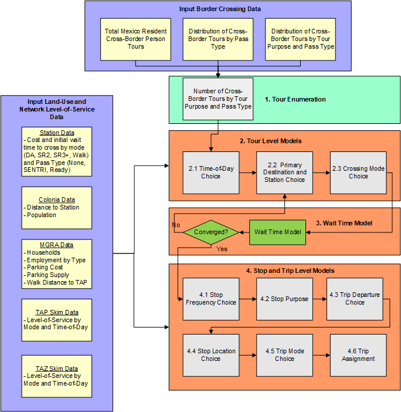
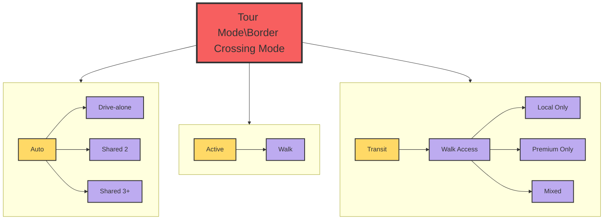

# Crossborder Model

The Cross-Border Travel Model predicts travel made by residents of Mexico within San Diego County. It predicts the border crossing point of entry as well as all trips made within the county. The model is limited to simulating travel made by Mexican residents who return to Mexico within the simulation day. Cross-border travel not captured by the Cross-Border Model includes:

* Residents of San Diego County who travel to/from Mexico. This travel is represented
by the resident travel model.
* Residents of Mexico (including U.S. citizens) who travel into San Diego County and who
do not return to Mexico at the end of the day. This travel is represented in the overnight
visitor travel model.
* Travel between points of entry through San Diego County to other U.S. destinations. This
travel is represented by the external-external travel model.
* Commercial vehicle travel to/from points of entry. This travel is represented by the
commercial vehicle model.

The overall design of the model is shown in the figure below.

#### Crossborder Model Purpose Definitions
There are five activity purposes in the cross-border travel demand model:
  * Work: Any activity involving work for pay.
  * School: Pre-k school, K-12, college/university, or trade school.
  * Shop: Shopping at retail, wholesale, etc.
  * Visit: Visiting friends or family
  * Other: A broad category including eating out, medical appointments, recreational activities, etc.

Note that home activities are not listed, since we do not model activities south of the border.

#### Crossborder Model Mode Definitions

The major tour modes are shown below:

The model has the following mode types at the trip level:
  * Drive-alone: Single occupant private vehicle
  * Shared 2: A private vehicle with exactly two passengers
  * Shared 3+: A private vehicle with three or more passengers
  * Walk: Walk mode
  * Bike: Bike mode
  * Walk-transit: Walk access to transit. There are three sub-types of transit: Local only,
  premium only, local + premium (which includes both local and premium services in the
  transit path)
  * Taxi: Door-to-door taxi trip
  * Single-pay TNC: Door-to-door TNC trip with a single payer (e.g. UberX)
  * Shared-pay TNC: Stop-to-stop TNC trip with potentially multiple payers (e.g. UberPool)

We also model tour mode, which is the mode used to cross the border. These modes include
drive-alone, shared 2, shared 3+ and walk. We assume that anyone crossing by bus or taxi is
similar to walk, since they do not have access to a personal vehicle for the rest of their travel in
San Diego County.

We also classify border crossings by lane type: general purpose, SENTRI, and Ready. We
assume that the use of these lanes is related to the border crossing party; we attribute each party with SENTRI or Ready availability. The proportion of total border crossing parties with access to SENTRI and Ready lanes are based on observed survey data, pooled across all stations. This data is used to simulate the availability of the lane to the travel party. Each lane crossing type is related to the wait time that the travel party experiences at each border crossing station by mode.

Below is a general description of the model structure.

1. Tour Enumeration: A list of person-tours is created by first cross-multiplying the input total
person tours with the share of tours by pass type, then expanding tours by pass type to tours
by pass type and purpose.
1. Tour Level Models
    2.1 Time-of-day Choice: Each person-tour is assigned an outbound and return half-hour 
    period.

    2.2 Primary Destination and Station Choice: Each border crossing person-tour chooses a 
    primary destination MGRA and border crossing station.

    2.3 Border Crossing Mode Choice: Each person-tour chooses a border crossing tour mode.

2. Wait Time Model
   
    3.1. Wait time model: Calculate wait time based on demand at each POE from model 2.2

    3.2. Convergence check: If max iterations reached (currently 3), goto Stop and Trip level models, else goto Model 2.2
3. Stop and Trip Level Models
    4.1 Stop Frequency Choice: Each person-tour is assigned number of stops by half-tour (outbound, return).

    4.2 Stop Purpose Choice: Each stop is assigned a stop purpose (consistent with the tour purposes).

    4.3 Trip Departure Choice: Each trip is assigned a half-hourly time period.

    4.4 Stop Location Choice: Each stop chooses an MGRA location.

    4.5 Trip Mode Choice: Each trip is assigned a trip mode.

    4.6 Trip Assignments: Trips are assigned to networks, along with resident and other special market trip tables, and skims are created for the next iteration of the model.

For more information on the Crossborder Travel Model see technical documentation.