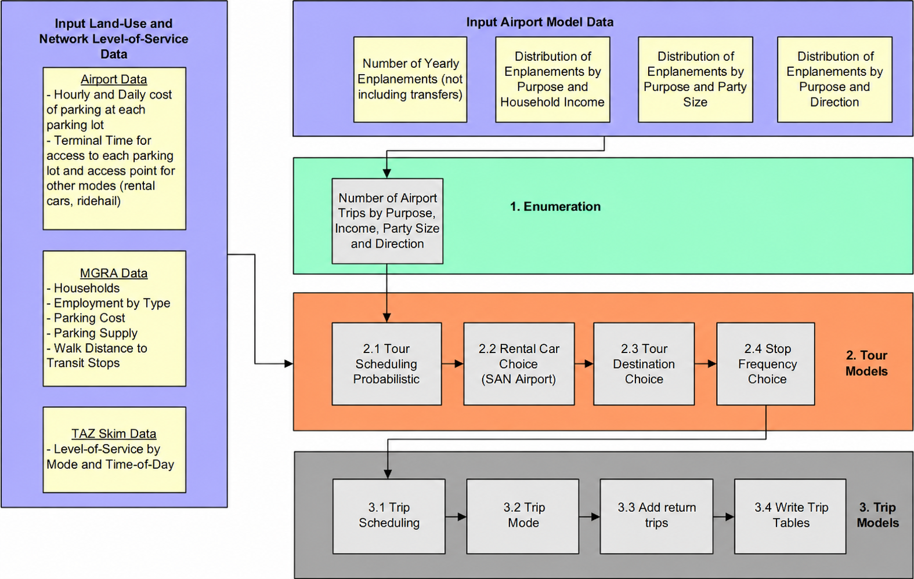
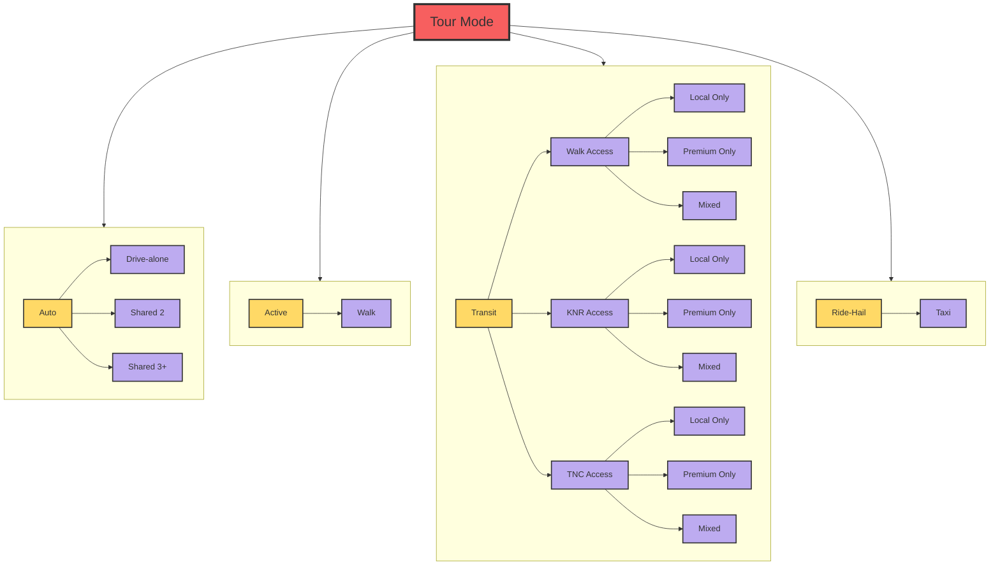

# Airport Ground Access Models

There are two airport ground access models - one for San Diego International Airport and one for the Crossborder Express terminal which provides access to Tijuana International Airport from the United States. Both models use the same structure and software code, though the parameters that control the total number of airport travel parties, off-airport destination, mode, arrival and departure times, and other characteristics, vary for each airport according to survey and airport-specific data.
The airport ground access model simulates trips to and from the airport for residents, visitors, and external travelers. These trips are generated by arriving or departing passengers and are modeled as tours within the ActivitySim framework. A post processing script also generates trips to serve passengers who require a pickup or dropoff at the airport. For example, a passenger who is picked up at the airport generates two trips; one trip to the airport by the driver to pick up the air passenger(s), and another trip from the airport with the driver and the air passenger(s).
It is important to note that, to work within the ActivitySim framework, the airport trips must be modeled as tours, rather than being generated directly as in the previous model. These tours are assigned an origin at the airport MGRA. During the stop frequency step of ActivitySim, a trip is assigned to the appropriate leg of the tour (either to or from the airport) while the opposite leg is not assigned any trips (referred to as the ‘dummy leg’). Passengers who are leaving on a departing flight and traveling to the airport are considered "inbound," while arriving passengers are considered "outbound".

The overall design of the model is shown in the figure below.

1. Tour Enumeration: A list of airport travel parties is generated from input enplanements and connecting passenger rates, as well as distributions that describe the share of travel parties by purpose (business versus personal), household income, and party size.
2. Tour Level Models
   
    2.1 Tour Scheduling Probabilistic: The tour scheduling model uses a probabilistic draw of the scheduling distribution. This model assigns start and end times to the tour. This is important because it will also serve as the schedule model for the final airport trips. In ActivitySim, trips are scheduled based on the tour schedule. If there is only one trip per leg on the tour (such as our case here) the trip is assigned the tour start/end time.

    2.2 Rental Car Choice (SAN Airport): For San Diego International Airport, a binary rental car choice model predicts whether airport travelers rent a vehicle. This model uses household income and party size as key explanatory variables to determine rental car use. The rental car choice decision occurs before tour destination and mode choice, as rental car availability affects subsequent travel decisions. If a party rents a car, the rental car location serves as an intermediate destination, and rental car fees are incorporated into the mode choice utilities. This model component enhances the realism of airport ground access patterns and rental car demand forecasting.

    2.3 Tour Destination Choice: The destination choice model chooses the non-airport end of the airport trips. Each tour is set with an origin at the airport MGRA. The tour destination model of ActivitySim is used to choose the non-airport end of the trip. The utility equation includes the travel distance, and the destination size terms. For San Diego International Airport, the model has been recalibrated with improved size terms using enhanced land use variables including log-transformed hotel room totals and meeting space square footage to better represent off-airport destination attractiveness. New preprocessing calculations and coefficient structures improve the model's sensitivity to land use characteristics and distance-based utilities. ActivitySim destination choice framework requires a mode choice log sum. A dummy tour mode choice log sum was created which generates a value of zero for every destination using the 'tour_mode_choice.csv' and 'tour_mode_choice.yml' file. This is a work around to prevent ActivitySim from crashing and not having to include the tour mode choice log sum in the destination choice model.

    2.4 Stop Frequency Choice: The stop frequency model is where the trip table is first created. The pre-processor tags each tour with a direction of 'inbound' or 'outbound' according to whether the tour is a departing or arriving passenger. For the Airport Ground Access model, inbound tours are tagged with zero outbound trips and -1 inbound trips (and the opposite is true for outbound tours: -1 outbound trips and 0 inbound trips). The 0 signifies that no intermediate stops are made; this leg of the tour will only have one trip. The -1 signifies that no trip is made at all on that leg. Using the -1 allows us to create 'half-tours' where only one leg of the tour is recorded as a trip.

3. Trip Level Models
 
    3.1 Trip Departure Choice: The trip scheduling model assigns depart times for each trip on a tour. ActivitySim requires trip scheduling probabilities; however, these are not used in this implementation since there is only one trip on any given tour leg. This means the trips will be assigned the tour scheduling times which were determined in the tour scheduling model. The trip scheduling probabilities file is just a dummy file.

    3.2 Trip Mode Choice: Each trip is assigned a trip mode; in the Airport Ground Access Model, trip mode refers to the airport arrival mode which simultaneously predicts the arrival mode and the location which the passenger uses to access that mode. The arrival modes are shown in the table below.  The trip mode choice yaml file contains detailed variables associated with each trip mode. For example, each parking location is given an MGRA location, a walk time, a wait-time, and a cost. If a parking location MGRA is set to -999 it is assumed to be unavailable and will not be in the choice set. The pre-processor in this step stores all values of skims from the trip origin to each of the access modes destinations along with any associated costs. Costs include parking fees per day, access fees, fares, and rental car charges.
    
    For San Diego International Airport, the mode choice model has been re-estimated using stated preference survey data to derive empirically-based values of time for four market segments. The new specification uses linear coefficients on travel time and cost variables, which provides clearer interpretation of willingness-to-pay measures compared to log-transformed alternatives. Cost coefficients are segmented by household income level, reflecting the economic hypothesis that higher-income travelers are less sensitive to travel costs than lower-income travelers. This approach improves behavioral realism and maintains consistency with established economic theory while enhancing model transparency for stakeholders.
    
    Employees are not fed into the trip mode choice model. Instead, if a transit share is specified in the employee park file, that percentage of employees will be assigned ‘Walk Premium’ mode in the pre-processor. Otherwise, employees are all assigned ‘Walk’ mode from the employee parking lot to the terminal.

    3.3 Airport Returns: Airport trips where the party is dropped off curbside or parked and escorted are assumed to also have the driver make a return trip to the non-airport location. This procedure is done as a post-processing step after mode choice and before trip tables are written out. An ‘airport_returns.yml’ file takes a user setting to determine which trip modes will include a return trip. These trips records are flagged and duplicated. The duplicated trips swap the origin and destination of the original trip and are assigned a unique trip id. These trips are tagged with ‘trip_num =2’ so they are easily sorted in any additional processing (such as for writing trip matrices).

    3.4 Write trip matrices: The write trip matrices step converts the trip lists into vehicle trip matrices. The matrices are segmented by trip mode and value of time bins. The vehicle trip modes in the matrices include SOV, HOV2, HOV3+, Taxi, and TNC-single. Value of time segmentation is either low, medium, or high bins based on the thresholds set in the model settings.

The major tour modes are shown below:

```mermaid
flowchart TD
    subgraph four
    direction LR
    E[Ride-Hail] --> E1[Taxi]
    end
    subgraph three
    direction LR
    D[Transit] --> D1[Walk Access]
    %% D --> D2[PNR Access]
    D --> D3[KNR Access]
    D --> D4[TNC Access]

    D1 --> D11[Local Only]
    D1 --> D12[Premium Only]
    D1 --> D13[Mixed]

    D3 --> D31[Local Only]
    D3 --> D32[Premium Only]
    D3 --> D33[Mixed]

    D4 --> D41[Local Only]
    D4 --> D42[Premium Only]
    D4 --> D43[Mixed]
    end
    subgraph two
    direction LR
    C[Active] --> C1[Walk]
    end

    subgraph one
    direction LR
    B[Auto] --> B1[Drive-alone];
    B --> B2[Shared 2];
    B --> B3[Shared 3+];
    end
    A[Tour Mode] --> one;
    A --> two;
    A --> three;
    A --> four;

    classDef group1 fill:#f75f5f,stroke:#333,stroke-width:4px,font-size:26px,font-weight:bold;wrap
    classDef group2 fill:#ffd966,stroke:#333,stroke-width:2px,font-size:20px;wrap
    classDef group3 fill:#bdabf0,stroke:#333,stroke-width:2px,font-size:18px;wrap

    classDef hiddenTitle color:transparent;
    class one,two,three,four hiddenTitle;

    class A group1;
    class B,C,D,E group2;
    class B1,B2,B3,C1,C2,C3,C4,D1,D2,D3,D4,E1,E2,E3,D11,D12,D13,D21,D22,D23,D31,D32,D33,D41,D42,D43 group3;
```

#### Airport Ground Access Model Trip Arrival Modes

| **Arrival Mode** | **Description** | **Airport Model** |
| --- | --- | --- |
| Park Location 1 | Party parks personal vehicle at parking location 1. | Both |
| Park Location 2 | Party parks personal vehicle at parking location 2. | CBX |
| Park Location 3 | Party parks personal vehicle at parking location 3. | CBX |
| Park Location 4 | Party parks personal vehicle at parking location 4. | Both |
| Park Location 5 | Party parks personal vehicle at parking location 5. | CBX |
| Curb Location 1 | Party is dropped off or picked up by another driver at curbside location 1. | Both |
| Curb Location 2 | Party is dropped off or picked up by another driver at curbside location 2. | CBX |
| Curb Location 3 | Party is dropped off or picked up by another driver at curbside location 3. | CBX |
| Curb Location 4 | Party is dropped off or picked up by another driver at curbside location 4. | CBX |
| Curb Location 5 | Party is dropped off or picked up by another driver at curbside location 5 | CBX |
| Park and Escort | Party is driven in personal vehicle, parks on-site at the airport and is escorted to/from airport. | CBX |
| Rental Car | Party arrives/departs by rental car. | Both |
| Shuttle Van | Party takes shuttle van. | Both |
| Hotel Courtesy | Party takes hotel courtesy transportation. | CBX |
| Ridehail Location 1 | Party arrives\departs using ridehail at ridehail location 1 | Both |
| Ridehail Location 2 | Party arrives\departs using ridehail at ridehail location 2 | CBX |
| Taxi Location 1 | Party arrives\departs using taxi at taxi location 1 | Both |
| Taxi Location 2 | Party arrives\departs using taxi at taxi location 2 | CBX |
| Walk Local | Party arrives\departs using walk-local bus | Both |
| Walk Premium | Party arrives\departs using walk-premium transit | Both |
| Walk Mix | Party arrives\departs using walk-local plus premium transit | Both |
| KNR Local | Party arrives\departs using KNR-local bus | Both |
| KNR Premium | Party arrives\departs using KNR-premium transit | Both |
| KNR Mix | Party arrives\departs using KNR-local plus premium transit | Both |
| TNC Local | Party arrives\departs using TNC-local bus | Both |
| TNC Premium | Party arrives\departs using TNC-premium transit | Both |
| TNC Mix | Party arrives\departs using TNC-local plus premium transit | Both |
| Walk | Party arrives\departs using walk | CBX | 

## Model Coordination and Restrictions

### Airport Terminal TAZ Restrictions

To prevent double-counting between the dedicated airport ground access models and general non-mandatory travel patterns, hard restrictions have been implemented to exclude airport terminal TAZs from being selected as general activity destinations. Specifically:

- **San Diego International Airport (SAN)**: TAZs 1457 and 4184 are restricted from resident, visitor, and crossborder non-mandatory tour and trip destination choice models
- **Cross Border Express (CBX)**: TAZ 1338 is similarly restricted

These restrictions ensure that trips to airport terminals are only generated through the specialized airport models described above, which properly account for airport-specific travel behaviors such as flight schedules, party sizes, rental car decisions, and specialized access modes. The restrictions are implemented in destination sampling procedures across:

- Resident models: non-mandatory tour destination, trip destination, and at-work subtour destination choice
- Visitor models: non-mandatory tour destination and trip destination choice
- Crossborder models: tour origin-destination choice and trip destination choice

This coordination between the airport models and general travel models maintains internal consistency in trip generation and avoids overestimating travel to airport terminal zones.

For more information on the Air Ground Access Travel Model see [technical documentation](https://sandag.github.io/ABM/pdf_reports/202402_ABM3_Model_Development_Report_Final.pdf).