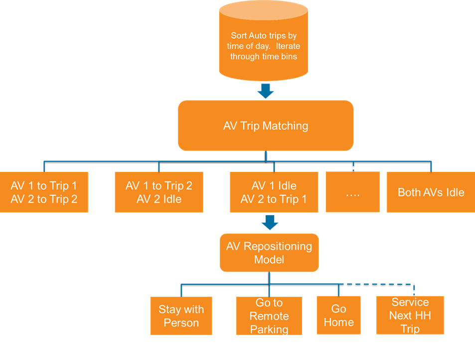

# Autonomous Vehicle (AV) Routing Model

The AV routing model simulates how household-owned autonomous vehicles are dispatched to serve household members' travel needs throughout the day. This model runs as a post-processing step after the resident model generates trips for households that own autonomous vehicles.

## Model Overview

The AV routing model performs intra-household autonomous vehicle routing, determining which trips are served by the household's AV(s) and how the vehicles reposition between trips. The model operates on a time-period basis, processing trips chronologically throughout the simulated day.

The model design is shown below:

## Model Components

### AV-Trip Matching

For each time period, the model matches available household AVs to trips that need to be served. The matching process:

1. **Identifies eligible trips**: Selects driving-mode trips from households with AVs
2. **Constructs alternatives**: Creates all possible AV-to-trip assignments within the household
3. **Evaluates utilities**: Uses skim data (travel time from vehicle location to trip origin) and other factors to score each assignment
4. **Makes choices**: Selects the optimal assignment of trips to AVs using a logit model

If multiple trips exist on the same tour during a time period, both trips are served by the same AV. If the AV is not at the trip origin, an additional repositioning trip is added.

### AV Repositioning

After serving trips, the model determines where each AV should go next. The repositioning alternatives include:

1. **Stay with person**: The AV waits at the current location with the person it just dropped off
2. **Go home**: The AV returns to the household's home location
3. **Go to remote parking**: The AV travels to a designated parking zone (useful in areas with limited parking)
4. **Service next household trip**: The AV proactively repositions to the origin of an upcoming trip for another household member

The repositioning choice is made using a utility-based model that considers:
- Travel time to each alternative destination
- Time until the next potential trip
- Parking availability at the current location

## Vehicle Trip Types

The model generates several types of vehicle trips:

| Trip Type | Description |
|-----------|-------------|
| `serving_trip` | AV traveling with a passenger to their destination |
| `going_home` | Empty AV returning to home location |
| `going_to_parking` | Empty AV traveling to remote parking |
| `repositioning` | Empty AV traveling to serve an upcoming trip |

## Outputs

The AV routing model produces:

- **AV Vehicle Trips Table**: A record of all vehicle movements including:
  - Vehicle ID and household ID
  - Origin and destination zones
  - Departure time
  - Whether the trip is a deadhead (empty) trip
  - Trip type (serving, repositioning, etc.)

## Relationship to Other Models

The AV routing model depends on outputs from the [resident model](resident.md), specifically the trip list for households with AVs. It uses skim matrices generated during the travel model run to evaluate travel times for both serving trips and repositioning trips.  The AV routing model runs as part of the resident model between trip mode choice and parking location choices models.

## Integration with Traffic Assignment

The AV vehicle trips are aggregated into origin-destination matrices for traffic assignment:

- **EmptyAVTrips.omx**: Contains deadhead/repositioning trips by time period
  - `EmptyAV_EA`, `EmptyAV_AM`, `EmptyAV_MD`, `EmptyAV_PM`, `EmptyAV_EV`

These matrices are imported alongside other demand matrices in the traffic assignment process. See the matrix builder (src/asim/scripts/taxi_tnc_routing/tnc_av_matrix_builder.py) for details on how these matrices are created.

ActivitySim resident model output matrices account for the trips served by AVs, so only the deadhead trips need to be added separately in this step.

## Configuration

The AV routing model is configured through `av_routing.yaml` with key settings including:

- `AV_TRIP_MATCHING_SPEC`: Specification file for AV trip matching model
- `AV_TRIP_MATCHING_COEFFICIENTS`: Coefficients file for AV trip matching model
- `AV_REPOSITIONING_SPEC`: Specification file for AV repositioning model
- `AV_REPOSITIONING_COEFFICIENTS`: Coefficients file for AV repositioning model
- `DRIVING_MODES`: List of trip modes eligible for AV routing
- `AV_PARKING_ZONE_COLUMN`: Land use column indicating remote AV parking availability
- `NEAREST_ZONE_SKIM`: Skim matrix used to find nearest parking zones

