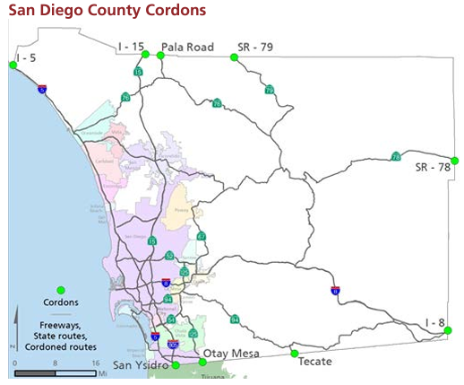

# External Models
The external aggregate travel models predict characteristics of US-SD and SD-US/MX travel behavior for all non-commercial, non-visitor vehicle trips and selected transit trips. Note that non-commercial MX-SD trips are forecast in the crossborder model, and non-commercial SD-US and SD-MX trips are forecast in the resident model.

## External Model Estimation of Trip Counts by Type
The total count of trips by production and attraction location was estimated in a series of steps:

1. The number of crossborder trips made by Mexican residents to attractions in San Diego was previously determined.
2. The trips in the resident travel survey were expanded to estimate the total number of trips made by San Diego residents to attractions in Mexico.
3. To derive an estimate of the number of US-MX trips, the number of MX-SD (1) and SD-MX (2) trips was subtracted from the total number of border-crossings.
    * The distribution of US-MX trips among external stations on the US-side of San Diego County will be assumed to be proportional to the total volume at each external station, regardless of the point of entry at the Mexican border.
4. The number of US-MX trips was then subtracted from the total number of trips in the SCAG cordon survey to arrive at an estimate of the combined total of US-US, US-SD, and SD-US trips with routes through San Diego County.
5. Finally, the actual amounts of US-US, US-SD, and SD-US trips at each external station were estimated from the remaining trips (4) according to their proportions in the successfully geocoded responses in the SCAG cordon survey.

## External Model Design Overview
The behavioral characteristics of the different types of external trip were derived from the various data sources available as follows:

* US-US trips: a fixed external station OD trip matrix was estimated from the SCAG cordon survey.
    * */src/main/emme/toolbox/model/external_external.py*
* US-MX trips: a fixed external station OD trip matrix was estimated from the SCAG cordon survey, Customs and Border Protection vehicle counts, and Mexican resident border-crossing survey as described in the previous section.
    * */src/main/emme/toolbox/model/external_external.py*
* US-SD trips: rates of vehicle trips per household for each external county were developed from the SCAG cordon survey, and the trips were distributed to locations in San Diego County according to a destination choice model estimated from the interregional survey.
    * Intermediate stops and transit trips are not modeled in this segment due to the small contribution of these events to the total demand in the segment.
    * */src/main/emme/toolbox/model/external_internal.py*

### External-Internal Destination Choice Model
The external-internal destination choice model distributes the EI trips to destinations within San Diego County. The EI destination choice model explanatory variables are:

* Distance
* The size of each sampled MGRA

Diurnal and vehicle occupancy factors are then applied to the total daily trip tables to distribute the trips among shared ride modes and different times of day.

### External-Internal Toll Choice Model
The trips are then split among toll and non-toll paths according to a simplified toll choice model. The toll choice model included the following explanatory variables:

* In-vehicle-time
* Toll cost

## Sources
information primarily taken from this SANDAG document: [link to pdf](https://www.sandag.org/-/media/SANDAG/Documents/PDF/data-and-research/applied-research-and-performance-monitoring/surveys/appendix-t-SANDAG-travel-demand-model-documentation.pdf)