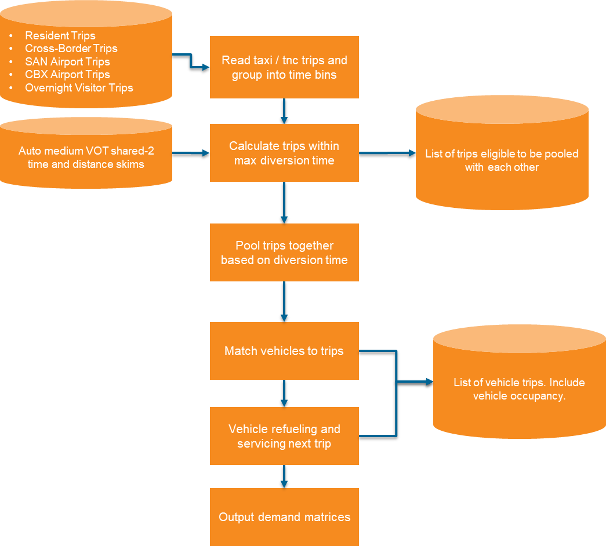

# Taxi and TNC Routing Model

The Taxi and Transportation Network Company (TNC) routing model simulates the operation of for-hire vehicle fleets serving passenger trips. This model processes TNC and taxi trips generated by the activity-based demand models and creates realistic vehicle routing patterns including pooled rides, empty repositioning, and refueling trips.

## Model Overview

The model operates as a microsimulation of a taxi/TNC fleet, processing trips in chronological order through fine-grained time bins. Key features include:

- **Trip pooling**: Matches compatible shared-ride requests to reduce vehicle miles traveled
- **Vehicle dispatching**: Assigns vehicles to trips based on proximity and availability  
- **Fleet management**: Tracks vehicle locations, mileage, and refueling needs
- **Deadhead routing**: Simulates empty vehicle repositioning between trips

The model design is shown below:

## Model Components

### Trip Pooling

For shared TNC modes, the model identifies opportunities to combine multiple passenger trips into a single vehicle route:

1. **Proximity filtering**: Finds trip pairs where both origins and destinations are within a configurable buffer (default: 10 minutes)
2. **Detour calculation**: Evaluates four possible routing scenarios for each pair:

    - Origin i → Origin j → Destination i → Destination j
    - Origin j → Origin i → Destination j → Destination i  
    - Origin i → Origin j → Destination j → Destination i
    - Origin j → Origin i → Destination i → Destination j

3. **Detour validation**: Filters out pairs where either passenger's detour exceeds the maximum allowed (default: 15 minutes)
4. **Mutual best selection**: Uses a recursive algorithm to select trip pairs where both trips prefer each other

### Vehicle Dispatching

The model maintains a fleet of vehicles and matches them to trips:

- **Free vehicles**: Vehicles that have completed their previous trip are matched to new trips based on proximity
- **New vehicles**: When no free vehicle is available within the maximum wait time, a new vehicle is created at the trip origin
- **Wait time tracking**: Records the time passengers wait for vehicle arrival

### Occupancy Tracking

Vehicle occupancy is tracked for each trip leg:

| Occupancy | Description |
|-----------|-------------|
| 0 | Empty/deadhead trip (repositioning or refueling) |
| 1 | Single passenger (or driver in non-AV scenario) |
| 2 | Two passengers |
| 3+ | Three or more passengers |

### Refueling

The model tracks cumulative vehicle mileage and routes vehicles to refueling stations when needed:

- Vehicles exceeding the maximum distance threshold are routed to the nearest zone with refueling stations
- Refueling trips are marked as deadhead trips with occupancy 0
- After refueling, the vehicle's odometer is reset

## Configuration

Key settings in `taxi_tnc_routing_settings.yaml`:

| Setting | Description | Default |
|---------|-------------|---------|
| `time_bin_size` | Simulation time bin size (minutes) | 10 |
| `pooling_buffer` | Max O-O and D-D time for pooling (minutes) | 10 |
| `max_detour` | Maximum detour time for pooled trips (minutes) | 15 |
| `max_wait_time` | Maximum wait before creating new vehicle (minutes) | 15 |
| `max_refuel_dist` | Maximum distance before refueling (miles) | 300 |
| `shared_tnc_modes` | Modes eligible for pooling | TNC_SHARED |
| `single_tnc_modes` | Solo ride modes | TNC_SINGLE, TAXI |

## Outputs

The model produces several output files:

### TNC Vehicle Trips (`output_tnc_vehicle_trips.csv`)

Each row represents a vehicle trip leg with columns:
- `vehicle_id`: Unique vehicle identifier
- `origin_taz`, `destination_taz`: Trip endpoints (TAZ level)
- `depart_bin`: Departure time bin
- `occupancy`: Number of passengers
- `trip_type`: pickup, dropoff, refuel, etc.
- `is_deadhead`: Whether the trip is empty

### Pooled Trips (`output_tnc_pooled_trips.csv`)

Details of matched trip pairs including:
- Trip IDs for both passengers
- Route scenario used
- Detour times for each passenger
- Stop sequence

This file is useful for analyzing pooling efficiency and general debugging of the pooling algorithm.

## Integration with Traffic Assignment

TNC vehicle trips are aggregated into origin-destination matrices:

- **TNCVehicleTrips_pp.omx**: One file per period with occupancy-based cores
  - `TNC_EA_0`, `TNC_EA_1`, `TNC_EA_2`, `TNC_EA_3` (and similar for AM, MD, PM, EV)

The matrix builder script (`tnc_av_matrix_builder.py`) reads the vehicle trip outputs and creates OMX matrices that are imported into traffic assignment alongside other demand matrices.

## Relationship to Other Models

### Upstream Dependencies

- **Resident Model**: Generates TNC_SINGLE, TNC_SHARED, and TAXI trips
- **Visitor Model**: Generates visitor TNC/taxi trips
- **Cross-border Model**: Generates cross-border TNC/taxi trips
- **Airport Model**: Generates airport ground access TNC/taxi trips

### Downstream Integration

The vehicle trip outputs can be used for:

- Traffic Assignment: TNC vehicle matrices are assigned to the highway network
- Fleet sizing analysis
- VMT and emissions calculations
- Equity analysis of service availability
