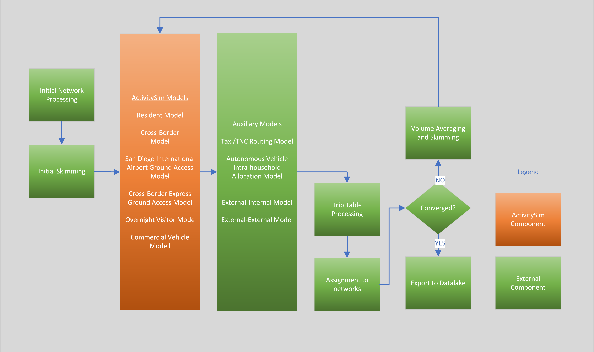

# Model Design

The ABM3 model system is primarily based on the [ActivitySim](https://research.ampo.org/activitysim/) platform; ActivitySim is used to model resident travel, cross-border travel, overnight visitor travel, airport ground access travel, and commercial vehicle travel including light, medium, and heavy commercial vehicles. 

Aggregate models are used to model external-internal travel (from external stations other than the U.S./Mexico border crossing) and through travel. The model system relies on [EMME](https://www.bentley.com/software/emme/) software for network processing, skimming, and assignment. Models are mostly implemented in [Python](https://www.python.org/), and some models are implemented in [Java](https://www.java.com/en/).

The overall design of the model is shown in the figure below:

<!--  -->

  <iframe loading="lazy" style="position: absolute; width: 100%; height: 100%; top: 0; left: 0; border: none; padding: 0;margin: 0;"
    src="https://www.canva.com/design/DAGVpoxVEFI/Bxj2j5xOY8bbau0LTmNz3Q/view?embed" allowfullscreen="allowfullscreen" allow="fullscreen">
  </iframe>

For a deeper explanation/definitions of some of the above process and terms (skims, network processing/assignments, etc.), check out [this website](https://tfresource.org/topics/00_Table_Contents.html#travel-behavior-models).

## **Initial Steps**

The system starts by performing initial input processing in EMME. This includes building transport networks and scenarios for skimming and assignment. An initial set of skims are created based on input trip tables (e.g. warm start). Then disaggregate choice models in ActivitySim are run, including:

- the [resident model](./demand/resident.md), 
- the [crossborder travel model](./demand/crossborder.md), 
- two [airport ground access models](./demand/airport.md), 
- the [overnight visitor model](./demand/visitor.md), 
- and the commercial vehicle model. 

Next auxiliary models are run:

- the taxi/TNC routing model and the autonomous vehicle intra-household allocation model are run in **Java**. 
- Aggregate external-internal and through travel models are run in **Python**. 

After all models are run, trip tables are built from the result and assigned to transport networks.

|   | scenario_id  | model          | otaz | dtaz |distance_total   |     |cost_total|
|---:|:------------|----------------|------|------|-----------------|-----|----------|
|  0 | 230    | external-internal   | 6    | 13   | 102.816         | ... |39.100    |
|  1 | 230    | external-internal   | 6    | 14   | 102.628         | ... |40.021    |
|  2 | 230    | external-internal   | 6    | 15   | 102.367         | ... |33.728    |
|  3 | 230    | external-internal   | 7    | 16   | 103.8597        | ... |33.179    |
|  4 | 230    | external-internal   | 7    | 17   | 101.568         | ... |32.941    |

*Example of a trip table for the external-internal model*

A check is made to determine whether the model has reached convergence (currently this is set to three feedback iterations). What this means in the context of the model is if an iteration is close enough to the results of another iteration, it will not run the next iteration.

If convergence is reached, outputs are processed for export to the SANDAG Datalake for reporting summaries. If not, speeds from assignment are averaged using method of successive averages, and skims are rebuilt for the next iteration. The model system is then re-run with the updated skims.

## **The Synthetic Population**

ActivitySim is used to represent all internal travel and internal-external made by residents of the SANDAG region (modeled area).  The decision-makers in the model system include both persons and households. These decision-makers are created (synthesized) for each simulation year and land-use scenario, and are based on Census data and forecasted distributions of households and persons by key socio-economic categories. 

A similar but simplified method is used to generate disaggregate populations for cross-border, airport ground access, and overnight visitor models. The decision-makers (such as people or households) are used in models that predict their choices. These models work by looking at a list of possible choices and selecting one based on a probability distribution of those choices. 

The probabilities are calculated using a method that considers both the characteristics of the decision-makers (like age or income) and the features of the options available. To make the choice, a random process is used, similar to drawing a number out of a hat (this is called [Monte Carlo simulation](https://aws.amazon.com/what-is/monte-carlo-simulation/)). The "decision-making unit" (the person or household) is key to how the model works and is carefully defined for each model.

One big advantage of using micro-simulation is that there are no limits on how many factors (like age, income, etc.) can be included in the model. However, even with this flexibility, the model will group some decision-makers into segments. This helps organize the model by, for example, creating different models for different types of people or for different roles within a household. 

As an example, there could be a model that examines how households with 0 / 1 / 2+ children without a car travel. This example examines at a household level, however, these segments can be based on either individuals or entire households.

## **Time of Day Modeling**

To account for variation in the transportation system throughout the day (such as how congestion is worse during peak periods than off-peak periods), the day is divided into five time periods. Assignment and skimming is done separately for each period, and the higher-resolution activitysim models use the appropriate skim for determining values such as a the travel time for a trip given the time of day that it's being made.

ABM3's time periods are defined as follows:

| Period | Name          | Start Time | End Time |
| ------ | ------------- | ---------- | -------- |
| EA     | Early Morning | 3:00 AM    | 5:59 AM  |
| AM     | AM Peak       | 6:00 AM    | 8:59 AM  |
| MD     | Mid-Day       | 9:00 AM    | 3:29 PM  |
| PM     | PM Peak       | 3:30 PM    | 6:59 PM  |
| EV     | Evening       | 7:00 PM    | 2:59 AM  |

<!-- The decision-makers are used in the subsequent discrete-choice models in a microsimulation framework where a single alternative is selected from a list of available alternatives according to a probability distribution.  The probability distribution is generated from a logit model which considers the attributes of the decision-maker and the attributes of the various alternatives. For example, (include a simple example here). The application paradigm is referred to as Monte Carlo simulation, since a random number draw is used to select an alternative from the probability distribution. The decision-making unit is an important element of model estimation and implementation and is explicitly identified for each model specified in the following sections.

A key advantage of using the micro-simulation approach is that there are essentially no computational constraints on the number of explanatory variables that can be included in a model specification.  However, even with this flexibility, the model system will include some segmentation of decision-makers.  Segmentation is a useful tool to both structure models (for example, each person type segment could have their own model for certain choices) and to characterize person roles within a household.  Segments can be created for persons as well as households. -->

