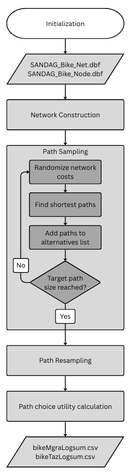

# Bike Logsums

## Usage

This model generates bike logsums and times for MGRA and TAZ pairs. It is designed to reflect the impact of bike infrastructure on path and mode choice for bicycle trips. It identifies likely routes along the all-streets network, considering factors such as presence and type of bike lane, turns, and gain in elevation. Note that the Bike mode uses bike logsums, while Ebike and Escooter use bike times.

This process generates the input\bikeMgraLogsum.csv and input\bikeTazLogsum.csv files. Bike logsums only need to be run when the active transportation (AT) network is updated. If logsums do not need to be updated, use the "Skip bike logsums" setting to automatically copy from the T:\ABM\release\ABM\version_X_X_X\input\20XX directory. This directory is updated manually.

## Design

<!--  -->

**Inputs:** The AT network is read from input\SANDAG_Bike_Net.dbf and input\SANDAG_Bike_Node.dbf. Coefficients and other settings are read from sandag_abm.properties.

**Network Construction:** Node and edge attributes are processed from the network files. Traversals are derived for edge pairs, using angle to determine turn type.

**Path Sampling:**

- Doubly stochastic, coefficients are randomized and resulting edge cost is randomized
- Dijkstra's algorithm finds path each origin to destination with minimum cost
- Add paths to path alternatives list and calculate path sizes from overlap of alternatives
- Repeat until minimum number of alternatives and minimum path size is met for each origin/destination pair

**Path Resampling:** Resample paths from alternatives list until minimum path size is met.

**Path Choice Utility Calculation:** Calculate bike logsum values for each origin/destination pair from utility expression on each path alternative.

**Outputs:** Bike logsums and times are written to input\bikeMgraLogsum.csv and input\bikeTazLogsum.csv. During ActivitySim preprocessing, TAZ values are added to BIKE_LOGSUM and BIKE_TIME matrices of output\skims\traffic_skims_AM.omx and MGRA values are written to output\skims\maz_maz_bike.csv.

## Further reading

[Active Transportation Improvements Report (2015)](https://github.com/SANDAG/ABM/wiki/files/at.pdf)