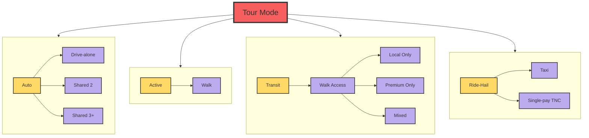

# Overnight Visitor Model
The Overnight Visitor Model simulates trips of visitors staying overnight in hotels, motels, short-term vacation rentals, and with friends and family. The trips are modeled as part of tours that begin and end at the place of lodging. However, unlike the resident model, the Overnight Visitor Model does not utilize a 24-hour activity schedule. Therefore it can be thought of as a simpler, tour-based model. Once each tour is generated, it is scheduled independently. The model uses the same time periods and modes as the resident model.
The overall design of the model is shown in the figure below.

1. Tour Enumeration: A list of visitor parties is generated from the input household data and hotel room inventory at the MGRA level. Visitor travel parties by segment (business versus personal) are calculated based on separate rates for hotels and for households. Visitor parties are generated by purpose based on tour rates by segment, then attributed with household income and party size based on input distributions. There are three purposes in the Overnight Visitor model:

   * Work:  Business travel made by business visitors.
   * Dining: Travel to food establishments for both business and personal visitors.
   * Recreational: All other non-work non-food related activities.

2. Tour Level Models
   
    2.1 Tour Scheduling Probabilistic: The tour scheduling model uses a probabilistic draw of the scheduling distribution. This model assigns start and end times to the tour. If there is only one trip per leg on the tour, the trip is assigned the tour start/end time.

    2.2 Tour Destination Choice: The destination choice model chooses the MGRA of the primary activity location on the tour.

    2.3 Tour Mode Choice: The tour mode choice model determines the primary mode of the tour.

3. Stop Level Models
   
    3.1 Stop Frequency Choice: The stop frequency model predicts the number of stops by direction based on input distributions that vary by tour purpose.

    3.2 Stop Purpose: The stop purpose model chooses the activity purpose of each intermediate stop based on input distributions that vary according to tour purpose.

    3.3 Stop Location Choice: The location choice model chooses the MGRA for each intermediate stop on the tour.

4. Trip Level Models
   
    4.1 Trip Departure Choice: The trip scheduling model assigns depart times for each trip on a tour based on input distributions that vary by direction (inbound versus outbound), stop number, and number of periods remaining on the tour.

    4.2 Trip Mode Choice: Each trip is assigned a trip mode, consistent with the modes in the resident model.
    
    4.3 Trip Assignment: Trips are aggregated by time of day, mode occupancy, value-of-time, and origin-destination TAZ and assigned simultaneously with other trips.

The major tour modes are shown below:

For more information on the Overnight Visitor Travel Model see technical documentation.